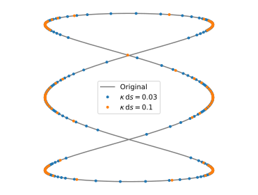

# Downsample

The `downsample` function reduces the sampling of a two-dimensional parametric curve.

## Simple example

We first create a parametric curve:
```python
from pylab import *

t = linspace(0,2*pi, 500)
x = cos(3*t)
y = sin(t)

plot( x, y, color = 'grey' )
```
We then import `downsample` and use it:
```python
from downsample import downsample

for kappa_ds_max in [0.03, 0.1] :
    x_ds, y_ds = downsample( x, y, kappa_ds_max )
    plot( x_ds, y_ds, '.' )
```
Here is the result:


